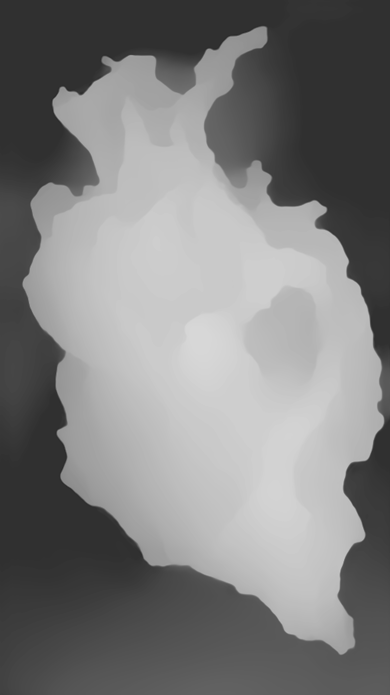
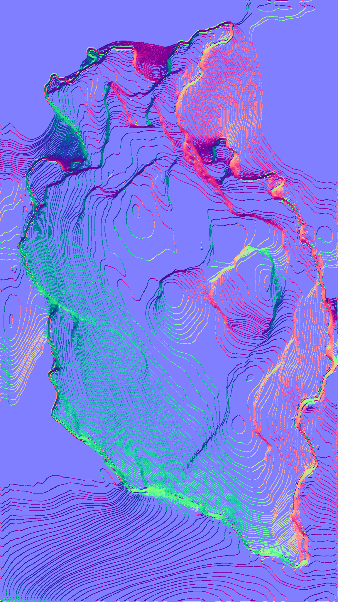

# Depth to Normal Map Converter

This script converts a depth map image to a normal map image.

</img> </img></img>

## Requirements

- Python 3.x
- OpenCV (`pip install opencv-python`)
- Numpy

## Usage

To run the script, use the following command:

```bash
python depth_to_normal_map.py --input /path/to/input_image --output /path/to/output_image --max_depth 255
```

The following arguments are available:

- `--input` (`-i`): Path to the input depth map image.
- `--output` (`-o`): Path to save the output normal map image.
- `--max_depth` (`-m`): Maximum depth value of the input depth map image (default: 255).

## Example

```bash
python depth_to_normal_map.py --input assets/depth.png --output normal_map.png --max_depth 255
```

## License

This script is licensed under the [MIT License](https://opensource.org/licenses/MIT).
