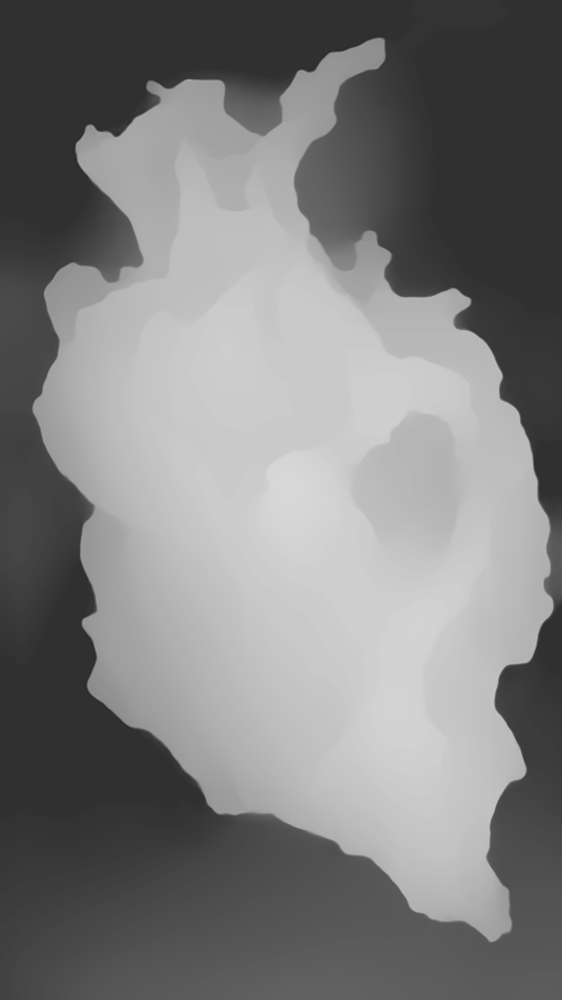
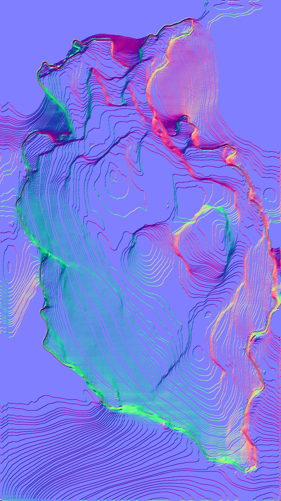

# depth2normal

Convert depth map images to RGB normal maps for shading and 3D workflows.

**Requirements:** Python 3.10 or newer. Runtime dependencies are NumPy, SciPy, Pillow, and Click (no OpenCV).

| Depth (input) | Normal map (output) |
| --- | --- |
|  |  |

## Install

**From PyPI** (after you publish the package):

```bash
pip install depth2normal
```

With uv in **another** project (not this repository):

```bash
uv add depth2normal
```

Or without editing that project’s `pyproject.toml`:

```bash
uv pip install depth2normal
```

> **Note:** Inside this repository, do **not** run `uv add depth2normal`—the project name matches the package name, and uv blocks that self-dependency. Use `uv sync` instead (see below).

## Usage

All CLI forms share the same options (see table at the end of this section).

### After `pip install` or `uv pip install`

```bash
depth2normal path/to/depth.png -o normal.png
```

### From a clone (recommended for development)

Install the project and dev tools, then use the console script or the helper script:

```bash
git clone https://github.com/cobanov/depth2normal.git
cd depth2normal
uv sync
```

```bash
uv run depth2normal assets/depth.png -o normal.png
```

Or run the repo-root helper without an editable install (still uses deps from `uv sync`):

```bash
uv run run.py assets/depth.png -o normal.png
```

With plain `python` (dependencies must be available in that environment, e.g. after `pip install -e .`):

```bash
python run.py assets/depth.png -o normal.png
```

Module entry point when `src` is on `PYTHONPATH` or the package is installed:

```bash
PYTHONPATH=src python -m depth2normal assets/depth.png -o normal.png
```

### Python API

```python
import depth2normal

depth2normal.convert("depth.png", "normal.png")
depth2normal.convert("depth.png", "normal.png", strength=2.0, method="gaussian", sigma=1.5)

import numpy as np

depth_array = np.load("depth.npy")
normal_map = depth2normal.depth_to_normal(depth_array, method="scharr")
```

### CLI options

| Option | Default | Description |
| --- | --- | --- |
| `-o`, `--output` | `normal_map.png` | Output image path |
| `-s`, `--strength` | `1.0` | Scales gradients (stronger = more pronounced normals) |
| `-m`, `--method` | `gaussian` | Gradient algorithm: `gaussian`, `sobel`, or `scharr` |
| `--sigma` | `1.0` | Gaussian kernel width (only with `--method gaussian`) |
| `--version` | — | Print version and exit |

Positional argument: path to the depth image file.

### Gradient methods

| Method | Quality | Speed | Notes |
| --- | --- | --- | --- |
| `gaussian` | Best | Moderate | Smooth normals via Gaussian derivative. `--sigma` controls the smoothness/detail tradeoff. |
| `sobel` | Good | Fast | Classic 3x3 Sobel. Sharp but can show staircase artifacts on quantized depth. |
| `scharr` | Good | Fast | Better rotational accuracy than Sobel, similar speed. |

## How it works

1. Load depth as grayscale float array.
2. Estimate surface gradients with the selected filter (Gaussian derivative, Sobel, or Scharr).
3. Build normals (-dx, -dy, 1), normalize to unit length, then map to 8-bit RGB.

## Development

```bash
uv sync
uv run pytest
uv run ruff check .
uv run ruff format --check .
```

## License

MIT
