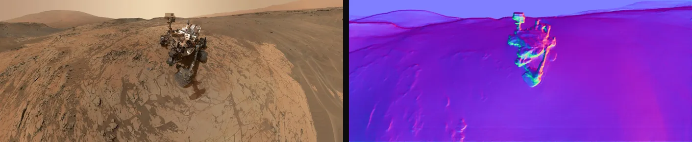
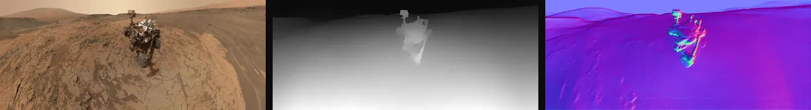

<p align="center">
  
</p>

<p align="center">
  A depth map goes in, a normal map comes out.<br>
  If you do not have a depth map, it estimates one.
</p>

<p align="center">
  <a href="https://pypi.org/project/depth2normal/"></a>
  <a href="https://github.com/cobanov/depth2normal/actions/workflows/ci.yml"></a>
  
  
  <a href="LICENSE"></a>
</p>

---

Turning depth into normals is a small piece of arithmetic: two gradients, a
vector, one normalisation. The parts that are usually missing sit on either
side of it. You need a depth map before you can start, and you need Python at
the other end to run the result. This package covers both.

```sh
pip install depth2normal
depth2normal depth.png -o normal.png
```

- **No depth map, no problem.** `--estimate` runs Depth Anything V2 Small on
  the photo first, so a photograph is a valid input.
- **The conversion exports to ONNX**, in about 1.7 KB, so it runs in a browser,
  in C#, in Unity, in a ComfyUI node, anywhere ONNX Runtime goes.
- **Scale invariant.** An 8-bit and a 16-bit copy of one depth map produce
  identical normals, so `strength` means the same thing in every file.
- **Three runtime dependencies**: NumPy, Pillow and Click. No SciPy, no OpenCV.
- **A browser demo in `web/`**, no build step, nothing uploaded.

## Install

```sh
pip install depth2normal              # the converter
pip install 'depth2normal[all]'       # plus ONNX export and depth estimation
```

`uv add depth2normal` works the same way. `[onnx]` is the export, `[estimate]`
is depth estimation, which needs Python 3.11 or newer because ONNX Runtime
publishes no 3.10 wheels.

## Use

```sh
depth2normal depth.png -o normal.png              # the common case
depth2normal depth.png -s 3 -m scharr             # stronger relief, sharper filter
depth2normal depth.png --invert                   # for maps where bright means far
depth2normal depth.tif --focal 1200 --range raw   # metric depth from a real camera
depth2normal photo.jpg --estimate -o normal.png   # no depth map needed
depth2normal estimate photo.jpg -o depth.png      # just the depth map
depth2normal export -o depth2normal.onnx          # just the graph
```

| Option | Default | What it does |
| --- | --- | --- |
| `-o`, `--output` | `normal_map.png` | Where the normal map goes |
| `-s`, `--strength` | `1.0` | Gradient multiplier, so how pronounced the relief is |
| `-m`, `--method` | `gaussian` | `gaussian`, `sobel` or `scharr` |
| `--sigma` | `1.0` | Gaussian kernel width, smoothness against detail |
| `--range` | `auto` | `auto`, `minmax` or `raw`, see [How it works](#how-it-works) |
| `--invert` | off | Flip near and far |
| `--focal` | | Focal length in pixels, for metric depth (see below) |
| `--estimate` | off | Treat the input as a photo and estimate its depth first |
| `--save-depth` | | Keep the estimated depth map as well |

```python
import depth2normal

depth2normal.convert("depth.png", "normal.png", strength=2.0, method="scharr")

depth = depth2normal.estimate_depth("photo.jpg")     # needs [estimate]
normal = depth2normal.depth_to_normal(depth, strength=3.0)

depth2normal.export_onnx("depth2normal.onnx")        # needs [onnx]
```

## From a photo

<p align="center">
  
</p>

`--estimate` runs [Depth Anything V2 Small](https://huggingface.co/onnx-community/depth-anything-v2-small)
(Apache-2.0, 99 MB) through ONNX Runtime, on CUDA if `onnxruntime-gpu` is
installed. The model is downloaded once, checksummed, and cached in
`~/.cache/depth2normal`, or wherever `DEPTH2NORMAL_CACHE` points.

What comes back is relative depth, not metres. That is what a normal map
needs, and it is not what a measurement needs.

## Anywhere ONNX Runtime goes

```sh
depth2normal export -o depth2normal.onnx --method gaussian --sigma 1
```

| | |
| --- | --- |
| Input `depth` | float32 `[1, 1, H, W]`, on the 0-255 range, height and width dynamic |
| Input `strength` | float32 scalar, so relief is tunable without re-exporting |
| Output `normal_map` | uint8 `[1, H, W, 3]`, RGB, ready for a canvas or an image file |
| Size | 1.1 KB for `sobel`, 6.1 KB for `gaussian` at sigma 3 |

Method and sigma are baked into the convolution weights, because they are the
kernel. Strength is not, so one file covers every strength.

The graph and the NumPy path agree to within **one level out of 255** on at
most 3% of pixels, which is float32 against float64 at a rounding boundary.
`tests/test_onnx_export.py` asserts it.

Prebuilt models for every method are attached to
[the latest release](https://github.com/cobanov/depth2normal/releases/latest).

## In the browser

**[depth2normal.cobanov.dev](https://depth2normal.cobanov.dev)** is the same
conversion as a single page: it loads the exported graph and runs everything
client side. The source is `web/`, with no build step and no bundler:

```sh
cd web && python3 -m http.server
```

A depth map converts in a few milliseconds of WebAssembly. Press **Estimate
depth** on a photograph and the quantised 27 MB model runs in the tab as well,
about 6.5 seconds for a 640x480 photo. Nothing is uploaded either way.

## How it works

1. Bring the depth values onto a fixed 0-255 range (see the table below).
2. Estimate `dx` and `dy` with a separable derivative filter, reflecting at the
   border.
3. Build `(-dx * strength, -dy * strength, 1)`, normalise it to unit length,
   and map it to 8-bit RGB.

Step 1 is the one that matters: it is what makes `strength` mean the same
thing whatever the input's bit depth.

| `--range` | What it does | When |
| --- | --- | --- |
| `auto` | Divides by the range the values came from: 0-1 float, 8-bit, or 16-bit | The default. Steady across a sequence |
| `minmax` | Stretches this image's min and max to 0-255 | Low contrast maps |
| `raw` | Leaves the values alone | Metric depth, or your own scaling |

The gradient filters:

| Method | Quality | Notes |
| --- | --- | --- |
| `gaussian` | Best | Gaussian derivative. `--sigma` trades smoothness against detail |
| `sobel` | Good | Classic 3x3. Sharp, but staircases on quantised depth |
| `scharr` | Good | Better rotational accuracy than Sobel, same speed |

All three are separable, which is what lets the package drop SciPy and still
match it to 1e-13 at the same speed, with 19.5 MB less to install. Their
kernels are normalised, so `strength` means the same thing whichever you pick.

### Metric depth

The default treats depth as a height field, which is what a shading normal map
wants. Given `--focal` (in pixels) it treats the depth as metric distance from
a pinhole camera instead, unprojects each pixel, and returns the normals of
that 3-D surface: the same plane twice as far away then comes out with the same
orientation. Pair it with `--range raw` so the metric values survive. The
exported ONNX graph is the height field form.

### Rings in the output

Contour rings are the source depth map's 8-bit steps, amplified by the
derivative. Raising `--sigma` smooths them away, and a 16-bit depth map does
not have them at all. Error against the same surface before quantisation:

| Source | Mean error |
| --- | --- |
| 8-bit, `--sigma 0.5` | 7.1 levels |
| 8-bit, `--sigma 1` | 2.4 levels |
| 8-bit, `--sigma 3` | 0.2 levels |
| 16-bit, `--sigma 1` | 0.01 levels |

## Measured

`tools/benchmark.py` prints these: median of five runs, `gaussian` at sigma 1,
on synthetic depth maps.

**Apple M4 Pro**, Python 3.14, ONNX Runtime on the CPU

| Size | NumPy | ONNX Runtime |
| --- | --- | --- |
| 1920 x 1080 | 53 ms | 12 ms |
| 1080 x 1920 | 52 ms | 10 ms |
| 4096 x 2304 | 243 ms | 54 ms |
| 2304 x 4096 | 243 ms | 55 ms |
| 8192 x 4608 | 958 ms | 211 ms |

**Intel i5-9600K with an RTX 3090**, Python 3.12

| Size | NumPy | ONNX Runtime | CUDA |
| --- | --- | --- | --- |
| 1920 x 1080 | 188 ms | 40 ms | 3 ms |
| 1080 x 1920 | 191 ms | 40 ms | 3 ms |
| 4096 x 2304 | 1003 ms | 216 ms | 13 ms |
| 2304 x 4096 | 984 ms | 184 ms | 13 ms |

Orientation is free: a portrait image and a landscape one of the same pixel
count land within a few percent of each other. The exported graph is four to
five times faster than NumPy on a CPU, and on a GPU it stops being the part
worth timing. The 37 megapixel row is missing from the second table because
that card was busy serving another model.

Depth estimation of a 640x480 photo takes 231 ms on the M4 Pro CPU and 32 ms on
the 3090.

## Development

```sh
uv sync --extra all
uv run pytest
uv run ruff check .
uv run ruff format --check .
uv run python tools/build_web_models.py
wrangler pages deploy web --project-name depth2normal   # the demo
```

## Licence

MIT. The depth model is Apache-2.0 and is downloaded, not vendored. Image
credits are in [assets/CREDITS.md](assets/CREDITS.md).
